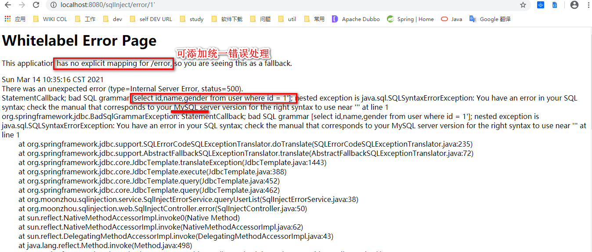
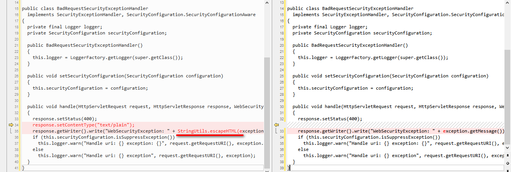

#### SQL injection
本示例使用springboot + jdbcTemplate进行展示

#### 前言
> 注入攻击的本质，是把用户输入的数据当做代码执行。这里有两个关键条件，第一个是用户能够控制输入，第二个是原本程序要执行的代码，拼接了用户输入的数据。

#### 概念
web应用程序对用户输入数据的合法性没有判断或过滤不严，攻击者可以在web应用程序中事先定义好的查询语句的结尾上添加额外的SQL语句，在管理员不知情的情况下实现非法操作，以此来实现欺骗数据库服务器执行非授权的任意查询，从而进一步得到相应的数据信息。

在SQL注入的过程中，如果Web应用对于报错信息进行了详细返回，则会为攻击者提供极大的便利，比如攻击者在参数中输入一个单引号“'”，引起执行查询语句的语法错误，服务器直接返回了错误信息：
```
select * from user where id=1';

select * from user where id=1';	Error Code: 1064. You have an error in your SQL syntax; check the manual that corresponds to your MySQL server version for the right syntax to use near ''' at line 1	0.000 sec
```
从错误信息中，我们可以知道使用的是Mysql数据库。查询的sql语句是使用的 `"select id,name,gender from user where id = " + id`。
示例请求：`http://localhost:8080/sqlInject/error/1'`


错误回显披露了敏感信息，对于攻击者来说，构造SQL注入的语句就可以更加得心应手了。

所以通常服务系统对于500的服务器错误，都是有统一的异常处理和业务展示页面，不会返回具体的错误信息，但是引入外部组件时需要小心，例如**统一加密组件会造成xss**。
```
bug类路径：BadRequestSecurityExceptionHandler

bug代码：
public void handle(HttpServletRequest request, HttpServletResponse response, WebSecurityException exception) throws IOException
  {
    response.setStatus(400);
    response.getWriter().write("WebSecurityException: " + exception.getMessage());
    if (this.securityConfiguration.isSuppressException())
      this.logger.warn("Handle uri: {} exception: {}", request.getRequestURI(), exception.getMessage());
    else
      this.logger.warn("Handle uri: {} exception", request.getRequestURI(), exception);
  }

修复后：
public void handle(HttpServletRequest request, HttpServletResponse response, WebSecurityException exception) throws IOException
  {
    response.setStatus(400);
    response.setContentType("text/plain");
    response.getWriter().write("WebSecurityException: " + StringUtils.escapeHTML(exception.getMessage()));
    if (this.securityConfiguration.isSuppressException())
      this.logger.warn("Handle uri: {} exception: {}", request.getRequestURI(), exception.getMessage());
    else
      this.logger.warn("Handle uri: {} exception", request.getRequestURI(), exception);
  }
```


如果对于不回显错误，这时就没有办法成功实施SQL注入攻击了吗？攻击者为了应对这种情况，研究出了“盲注”(Blind Injection)的技巧。

所谓“盲注”，就是在服务器没有错误回显时完成的注入攻击。服务器没有错误回显，对于攻击者来说缺少了非常重要的“调试信息”，所以攻击者必须找到一个方法来验证注入的SQL语句是否得到了执行。

最常见的盲注验证方法是，构造简单的条件语句，**根据返回页面是否发生变化**，来判断SQL语句是否得到了执行。如下面的实例：

#### sql注入实例
1. 查询条件（外部输入）
```
1 or 1=1
```
1. 查询sql（代码）
```java
String sql = "select id,name,gender from user where id = " + id;
return jdbcTemplate.query(sql, new BeanPropertyRowMapper(User.class));
```
1. 执行sql（最终执行）
```
select * from user where id=1 or 1=1;

# 正常业务：
select * from user where id=1
```

#### Mybatis下示例


#### 工具
1. sqlMap(TODO 实践)

#### 如何避免
1. 不使用sql拼接，采用预编译方式，执行sql，在jdbcTemplate上体现为使用：`query(String sql, @Nullable Object[] args, RowMapper<T> rowMapper)`
1. 做好上层的数据校验，长度，类型，sql关键词（不是根本有效手段，潜在的防御方式，根本还是第一点）

#### 江湖记事
1. 乌云 世纪佳缘
1. 现阶段大家可以直接到对应网站的src进行漏洞提交，src列表：
    * [安全客](https://www.anquanke.com/src)
    * [i春秋](https://www.ichunqiu.com/src)

#### 参考
1. 《白帽子讲Web安全》

#### My Github
1. https://github.com/moon-zhou/spring-learning/tree/master/spring-boot-sql-injection
1. https://github.com/moon-zhou/spring-learning/blob/master/spring-boot-xss/src/main/java/org/moonzhou/xss/web/SQLInjectionController.java