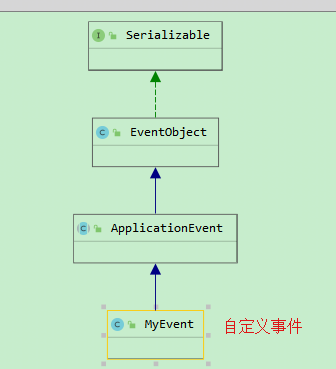

### spring Event&Listener
spring事件是基于事件/监听器编程模型，在这个模型中，有几个重要的角色，事件（`ApplicationEvent`），应用事件监听器（`ApplicationListener`），以及事件发布者（`ApplicationContext`）。

#### spring自有的Event
| Event                        | Explanation                                                  |
| :--------------------------- | :----------------------------------------------------------- |
| `ContextRefreshedEvent`      | Published when the `ApplicationContext` is initialized or refreshed (for example, by using the `refresh()` method on the `ConfigurableApplicationContext` interface). Here, “initialized” means that all beans are loaded, post-processor beans are detected and activated, singletons are pre-instantiated, and the `ApplicationContext` object is ready for use. As long as the context has not been closed, a refresh can be triggered multiple times, provided that the chosen `ApplicationContext` actually supports such “hot” refreshes. For example, `XmlWebApplicationContext` supports hot refreshes, but `GenericApplicationContext` does not. |
| `ContextStartedEvent`        | Published when the `ApplicationContext` is started by using the `start()` method on the `ConfigurableApplicationContext` interface. Here, “started” means that all `Lifecycle` beans receive an explicit start signal. Typically, this signal is used to restart beans after an explicit stop, but it may also be used to start components that have not been configured for autostart (for example, components that have not already started on initialization). |
| `ContextStoppedEvent`        | Published when the `ApplicationContext` is stopped by using the `stop()` method on the `ConfigurableApplicationContext` interface. Here, “stopped” means that all `Lifecycle` beans receive an explicit stop signal. A stopped context may be restarted through a `start()` call. |
| `ContextClosedEvent`         | Published when the `ApplicationContext` is being closed by using the `close()` method on the `ConfigurableApplicationContext` interface or via a JVM shutdown hook. Here, "closed" means that all singleton beans will be destroyed. Once the context is closed, it reaches its end of life and cannot be refreshed or restarted. |
| `RequestHandledEvent`        | A web-specific event telling all beans that an HTTP request has been serviced. This event is published after the request is complete. This event is only applicable to web applications that use Spring’s `DispatcherServlet`. |
| `ServletRequestHandledEvent` | A subclass of `RequestHandledEvent` that adds Servlet-specific context information. |

#### 自定义Event
1. 继承 `ApplicationEvent`
1. 实现 `ApplicationListener`，同时第一步里自定义的Event通过泛型，传入本步骤里的自定义Listener
1. `ApplicationContext`进行事件发布
1. 其他：`@Order`来调整监听的顺序

相关代码结构如下：



#### MyHub

```java


// springboot的测试方法
@SpringBootTest
@RunWith(SpringRunner.class)
public class ListenerTest {
  @Autowired
  private ApplicationContext applicationContext;

  @Test
  public void testListenner() {
    MyEvent myEvent = new MyEvent("myEvent", 001L, "running~~~");
    applicationContext.publishEvent(myEvent);
  }
}
```


#### 参考
1. [spring doc](https://docs.spring.io/spring-framework/docs/current/reference/html/core.html#spring-core)
2. [Spring ApplicationListener的使用](Spring ApplicationListener的使用)
3. [spring事件之ApplicationListener](https://www.jianshu.com/p/0fb29a27eb61)