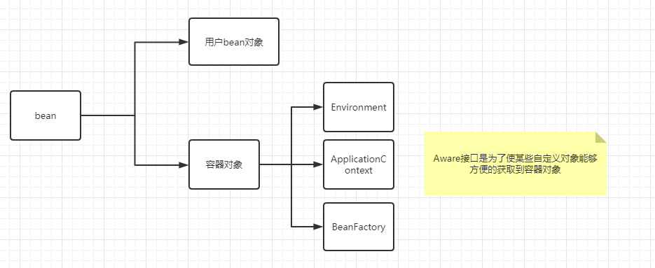
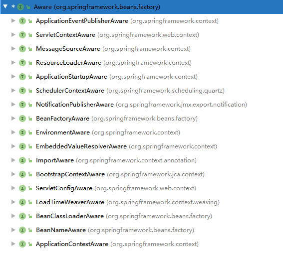

### spring IOC

#### 配置方式
##### xml方式，`<bean>`
1. 构造函数：**构造函数方式初始化，可以不写`get/set`方法**
    * xml里未实际配置，直接调用空的构造方法（显示的空的构造方法或者隐式的空的构造方法）
    * `constructor-arg`使用`index`方式初始化，值的位置在代码前后上是可以调整的，但是value类型必须和构造函数的方法一致。
        ```xml
        <constructor-arg index="0" value="1"/>
        <constructor-arg index="1" value="100"/>
        <constructor-arg index="2" value="g"/>
        <constructor-arg index="3" value="xiaomi"/>
      
        <constructor-arg index="0" value="1"/>
        <constructor-arg index="2" value="g"/>
        <constructor-arg index="3" value="xiaomi"/>
        <constructor-arg index="1" value="100"/>
        
        这两种效果都是一样的，但是1对应的数据类型，必须是构造方法里的数据类型，同理其他的也需要一致，否则bean会创建失败。
        org.moonzhou.spring.ioc.xml.bean.Device.Device(java.lang.Integer, java.math.BigDecimal, java.lang.String, java.lang.String)
        ```
    * `constructor-arg`使用`name`方式初始化：如果有多个构造方法，则会根据给出参数个数以及参数类型，自动匹配到对应的构造方法上，进而初始化一个对象。
1. `set`方法注入:
    * 使用`property & name` + `set`方法，实现实例对象的初始化。
        > 凡是涉及到反射注入值的，属性名统统都不是 Bean 中定义的属性名，而是通过 Java 中的内省机制分析出来的属性名，简单说，就是根据 get/set 方法分析出来的属性名。
    * 使用`p`标签
        > 注意该标签需要加上xml的namespace：xmlns:p="http://www.springframework.org/schema/p"
1. 外部`Bean`的注入：自己写的 Bean 一般不会使用这两种方式注入，但是，如果需要引入外部 jar，外部 jar 的类的初始化，有可能需要使用这两种方式。
    * 静态工厂
    * 实例工厂
1. 复杂属性的注入：对象/数组/Map/Properties

##### Java 配置（通过 Java 代码将 Bean 注册到 Spring 容器中）
1. 需要添加`@Configuration`和`@Bean`，Bean 的默认名称是方法名（内省-Introspector）。以上面的案例为例，Bean 的名字是 `sayHello/sayHi/sayHi2`。
1. 配置的加载，是使用`AnnotationConfigApplicationContext`来实现

##### 自动化配置(包扫描，既可以配置xml，也可以通过Java代码进行配置)
1. 注解：`@Configuration` + `@ComponentScan`
    * 根据包位置进行扫描
    * 根据注解类型进行扫描
2. xml
    * 根据包位置进行扫描
    * 根据注解类型进行扫描
    * 注意点：需要添加namespace
        ```xml
        xmlns:context="http://www.springframework.org/schema/context"
        xsi:schemaLocation="http://www.springframework.org/schema/context
                        http://www.springframework.org/schema/context/spring-context.xsd"
        ```
##### 混合模式
`Java 配置` + `XML 配置`，核心是使用`@Configuration`和`@ImportResource`，示例：
```java
org.moonzhou.spring.ioc.mix

@Configuration
@ImportResource("classpath:applicationContext.xml")
public class JavaConfig {

    @Bean
    MIPhone miPhone() {
        return new MIPhone();
    }
}
```

#### 注入
1. `@Autowired`: org.springframework.bean.factory，`通过AutowiredAnnotationBeanPostProcessor`类实现的依赖注入，与`@inject`二者具有可互换性。
1. `@Resources`: JSR250 (Common Annotations for Java)，通过`CommonAnnotationBeanPostProcessor`类实现依赖注入
1. `@Injected`: JSR330 (Dependency Injection for Java)

##### Inject using Interface type
如果有多个实现，直接按接口类型注入，以上三个注解，都会抛出异常。\[为了使其他示例可以正常运行，Demo001*相关的示例已经将`@Component`注释，避免扫描注入相关依赖时报错\]
```
org.moonzhou.spring.ioc.injection.biz.Demo001AutowiredInterfaceType
org.moonzhou.spring.ioc.injection.biz.Demo001InjectInterfaceType
org.moonzhou.spring.ioc.injection.biz.Demo001ResourceInterfaceType

org.springframework.beans.factory.UnsatisfiedDependencyException: 
Error creating bean with name 'demo001AutowiredInterfaceType': 
Unsatisfied dependency expressed through field 'vehicle'; 
nested exception is org.springframework.beans.factory.NoUniqueBeanDefinitionException: 
No qualifying bean of type 'org.moonzhou.spring.ioc.injection.service.Vehicle' available: 
expected single matching bean but found 2: fourWheeler,twoWheeler
```

##### Inject using field type as concrete class
按照实现类，具体类名直接注入。
```java
org.moonzhou.spring.ioc.injection.biz.Demo002AutowiredConcreteClass
org.moonzhou.spring.ioc.injection.biz.Demo002InjectConcreteClass
org.moonzhou.spring.ioc.injection.biz.Demo002ResourceConcreteClass

@Resource
TwoWheeler vehicle;
 
@Autowired
TwoWheeler vehicle;
 
@Inject
TwoWheeler vehicle;
```

##### injecting using field name
根据注入的属性名为bean的name来进行注入。
```java
org.moonzhou.spring.ioc.injection.biz.Demo003AutowiredFiledName
org.moonzhou.spring.ioc.injection.biz.Demo003InjectFiledName
org.moonzhou.spring.ioc.injection.biz.Demo003ResourceFiledName

@Resource
Vehicle twoWheeler;
 
@Autowired
Vehicle twoWheeler;
 
@Inject
Vehicle twoWheeler;
```

##### Qualifier with default bean name
注入时仍使用接口类名，属性名不使用bean name（第一种注入方式，报错的方式）。但是需要配合`@Qualifier`显示表名注入的bean name。
`@Resource`的name与`@Qualifier`效果一致
```java
org.moonzhou.spring.ioc.injection.biz.Demo004AutowiredQualifierBeanName
org.moonzhou.spring.ioc.injection.biz.Demo004InjectQualifierBeanName
org.moonzhou.spring.ioc.injection.biz.Demo004ResourceQualifierBeanName

@Resource
@Qualifier("fourWheeler")
Vehicle vehicle;
等同于
@Resource(name = "twoWheeler")
Vehicle vehicle;

@Autowired
@Qualifier("twoWheeler")
private Vehicle vehicle;

@Inject
@Qualifier("threeWheelerVehcile")
Vehicle vehicle;
```

##### Injecting list of beans
按接口类注入bean的列表
```java
org.moonzhou.spring.ioc.injection.biz.Demo005AutowiredListBean
org.moonzhou.spring.ioc.injection.biz.Demo005InjectListBean
org.moonzhou.spring.ioc.injection.biz.Demo005ResourceListBean

@Resource
private List<Vehicle> vehicles;
 
@Autowired
private List<Vehicle> vehicles;
 
@Inject
private List<Vehicle> vehicles;
```

##### special behavior of @Resource during beans conflict while injecting
当使用`@Qualifier`指定bean name时，而此bean name不存在，`@Autowired`和`@Inject`则会注入失败（相关示例类的`@Component`注解已注释，避免影响其他类无法测试）。

而`@Resource`会根据属性名进行注入，而忽略掉`@Qualifier`里的bean name，所以这个示例是可以正常运行的。
```java
org.moonzhou.spring.ioc.injection.biz.Demo006AutowiredFiledNameConflictQualifier
org.moonzhou.spring.ioc.injection.biz.Demo006InjectFiledNameConflictQualifier
org.moonzhou.spring.ioc.injection.biz.Demo006ResourceFiledNameConflictQualifier

@Autowired
@Qualifier("noSuchBean")
Vehicle twoWheeler;

@Inject
@Qualifier("noSuchBean")
Vehicle twoWheeler;

@Resource
@Qualifier("noSuchBean")
Vehicle twoWheeler;
```

##### 注入总结
`@Autowired` and `@Inject`
1. **Match by Type** -> bean with same Data type of the variable should be available in spring container
2. **Restricts by Qualifier** -> If bean of variable’s data type not found or many implementation of the type available then it looks for any qualifier defined and if defined it uses Qualifier and wont go for 3rd option
3. **Matches by Name** –> searches the bean in the spring whose id should be same as variable name defined while autowiring.

`@Resource`
1. **Match by Name** -> first it searches for the bean in spring whose id should be same as variable name declared.
2. **Match by Type** -> bean with same Data type of the variable should be available in spring container
3. **Restricts by Qualifier**(ignores if 1st attempt said above by name matches)

```
@Autowired和@Inject
默认 autowired by type
可以 通过@Qualifier 显式指定 autowired by qualifier name。

@Resource
默认 autowired by field name
如果 autowired by field name失败，会退化为 autowired by type
可以 通过@Qualifier 显式指定 autowired by qualifier name
如果 autowired by qualifier name失败，会退化为 autowired by field name。但是这时候如果 autowired by field name失败，就不会再退化为autowired by type了。
```

* Spring自带的@Autowired的缺省情况等价于JSR-330的@Inject注解；
* Spring自带的@Qualifier的缺省的根据Bean名字注入情况等价于JSR-330的@Named注解；
* Spring自带的@Qualifier的扩展@Qualifier限定描述符注解情况等价于JSR-330的@Qualifier注解。

##### 其他
Spring组件模型元素与JSR-330变体

| Spring              | javax.inject.*        | javax.inject restrictions / comments                         |
| ------------------- | --------------------- | ------------------------------------------------------------ |
| @Autowired          | @Inject               | @Inject没有“必需”属性。可以与Java 8一起使用Optional。        |
| @Component          | @Named / @ManagedBean | JSR-330不提供可组合模型，只是一种识别命名组件的方法。        |
| @Scope(“singleton”) | @Singleton            | JSR-330默认范围就像Spring一样prototype。但是，为了使其与Spring的一般默认值保持一致，singleton默认情况下在Spring容器中声明的JSR-330 bean是一个默认值。为了使用除以外的范围singleton，您应该使用Spring的@Scope注释。javax.inject还提供了 @Scope注释。然而，这个仅用于创建自己的注释。 |
| @Qualifier          | @Qualifier / @Named   | javax.inject.Qualifier只是构建自定义限定符的元注释。具体String限定符（如@Qualifier带有值的Spring ）可以通过关联javax.inject.Named。 |
| @Value              | -                     | 没有等价物                                                   |
| @Required           | -                     | 没有等价物                                                   |
| @Lazy               | -                     | 没有等价物                                                   |
| ObjectFactory       | Provider              | javax.inject.Provider是Spring的直接替代品ObjectFactory，只有较短的get()方法名称。它也可以与Spring @Autowired或非注释构造函数和setter方法结合使用。 |

#### 条件注入
两个 Bean 取相同的名字，这样在调用时，才可以自动匹配。然后，给每一个 Bean 加上条件注解，当条件中的 matches 方法返回 true 的时候，这个 Bean 的定义就会生效。

典型的使用场景，就是多环境切换。Spring中的`Profile`的底层就是条件注解，这个从`@Profile`注解的定义就可以看出来：
```
1. 实现Condition，多个（因为要多条件选择）
2. @Conditional里加上对应实现的Condition.class
3. @Bean注解保证需要选择创建的多个bean name一致，但 new 的对象和条件选择里要一一对应好。
4. Profile的底层实现就是条件注解

示例：
org.moonzhou.spring.ioc.condition
```

#### scope
spring默认支持的Scope只有两种：
* singleton 单例，每次从spring容器中获取到的bean都是同一个对象。
* prototype 多例，每次从spring容器中获取到的bean都是不同的对象。

spring web又对Scope进行了扩展，增加了：
* RequestScope 同一次请求从spring容器中获取到的bean都是同一个对象。
* SessionScope 同一个会话从spring容器中获取到的bean都是同一个对象。 
1. 直接配置使用方式:`org.moonzhou.spring.ioc.scope`
    1. xml方式
    1. java config方式
    1. 自动包扫描方式
    1. 注意点：
        * `xml`和`java config`的`Scope`跟Bean的配置在一起，而包扫描方式，`Scope`直接写在Bean的类上。
        * Singleton Beans with Prototype-bean Dependencies(singleton bean 依赖 prototype bean)：prototype bean也表现为singleton bean
            > When you use singleton-scoped beans with dependencies on prototype beans, be aware that dependencies are resolved at instantiation time. Thus, if you dependency-inject a prototype-scoped bean into a singleton-scoped bean, a new prototype bean is instantiated and then dependency-injected into the singleton bean. The prototype instance is the sole instance that is ever supplied to the singleton-scoped bean.
            * 方案1：`lookup-method`(xml配置) 或者 `@Lookup`(注解)
            * 方案2：`Method Injection` (Aware侵入式`getBean`，手动获取)
            * 示例：`org.moonzhou.spring.ioc.scope.dependencies`
1. 自定义`Scope`
TODO

#### Aware 接口
Spring框架中提供了许多实现了Aware接口的类，这些类主要是为了辅助一些自定义的类（bean）访问容器中的对象信息。

##### 公共特性
1. 都是以 `Aware` 结尾
1. 都继承自 Aware
1. 接口内均定义了一个 `set` 方法
##### spring 中的 Aware 接口


| Aware子接口                    | 描述                                                         |
| :----------------------------- | :----------------------------------------------------------- |
| BeanNameAware                  | 获取容器中 Bean 的名称                                       |
| BeanFactoryAware               | 获取当前 BeanFactory ，这样可以调用容器的服务                |
| ApplicationContextAware        | 同上，在[BeanFactory 和 ApplicationContext 的区别](https://mp.weixin.qq.com/s/YVl20QqUHTXMubr68wXR1A) 中已明确说明 |
| MessageSourceAware             | 获取 Message Source 相关文本信息                             |
| ApplicationEventPublisherAware | 发布事件                                                     |
| ResourceLoaderAware            | 获取资源加载器，这样获取外部资源文件                         |

1. `BeanNameAware`：

##### 使用方式
1. 实现相关 `Aware` 接口，重写对应的 `set` 方法
1. 对应 `set` 方法里，将入参里的 `spring` 容器相关属性设置到自己使用到的相关 `bean` 里
##### 使用场景
1. 需要动态获取 `spring bean`，如工具类，singleton 依赖 prototype 时的解决方案
    ```java
    /**
     * 自定义一个实现类，一定要注入到容器中
     */
    @Component
    public class ApplicationContextAwareImpl implements ApplicationContextAware {
    ​
        /**
         * 容器启动的时候会调用这个方法，只需要将applicationContext设置即可
         * @param applicationContext 容器启动会自动注入
         * @throws BeansException
         */
        @Override
        public void setApplicationContext(ApplicationContext applicationContext) throws BeansException {
            //将其设置到ApplicationContextUtil
            ApplicationContextUtil.setApplicationContext(applicationContext);
        }
    }
    
    import org.springframework.context.ApplicationContext;
    /**
     * ApplicationContext的工具类
     */
    public class ApplicationContextUtil {
        /**
         * ApplicationContext对象，会ApplicationContextAwareImpl中的setApplicationContext方法中赋值
         */
        private static ApplicationContext applicationContext;
    ​
        public static ApplicationContext getApplicationContext() {
            return applicationContext;
        }
    ​
        public static void setApplicationContext(ApplicationContext applicationContext) {
            ApplicationContextUtil.applicationContext = applicationContext;
        }
    ​
        /**
         * 根据类型获取指定的bean
         * @param requiredType Class
         * @param <T> 泛型
         * @return
         */
        public static <T> T getBean(Class<T> requiredType ){
            return applicationContext.getBean(requiredType);
        }
    ​
        /**
         * 根据名称和类型获取Bean
         * @param name bean的id
         * @param requiredType class
         * @param <T>
         * @return
         */
        public static <T> T getBean(String name,Class<T> requiredType){
            return applicationContext.getBean(name,requiredType);
        }
    }
    
    // 工具类使用
    StringRedisTemplate redisTemplate=ApplicationContextUtil.getBean("stringRedisTemplate",StringRedisTemplate.class);
    
    ```
    ```java
    org.moonzhou.spring.ioc.scope.dependencies.DependenciesTest
    ```
1. 


#### 其他
1. `id`和`name`的区别
    
    在`XML`配置中，我们可以看到，即可以通过`id`给`Bean`指定一个唯一标识符，也可以通过`name`来指定，大部分情况下这两个作用是一样的，有一个小小区别：`name`支持取多个。多个`name`之间，用`,`隔开：
    ```xml
    <bean name="pen1,pen2,pen3" class="org.moonzhou.spring.ioc.xml.bean.Pen" scope="prototype" />
    ```

#### 测试
1. 使用JUnit测试
    > 使用 ClassPathXmlApplicationContext 获取上下文，通过 getBean 获取bean。
1. 使用JUnit+Spring-Test
    > 需要注意的是 spring-test 需要和 Spring 版本保持一致，使用 RELEASE 版本。
1. 示例：`src\test\java\org\moonzhou\spring\ioc\xml\bean`

#### 代码实操顺序（尤其是对于test以及applicationContext.xml）
1. 无参构造函数初始化-(隐式)：`org.moonzhou.spring.ioc.xml.bean.Book`
1. 无参构造函数初始化-(显示)：`org.moonzhou.spring.ioc.xml.bean.User`
1. 有参构造函数初始化-(constructor-arg & index)：`org.moonzhou.spring.ioc.xml.bean.Device`
1. 有参构造函数初始化-(constructor-arg & name)：`org.moonzhou.spring.ioc.xml.bean.Car`
1. set方法初始化：`org.moonzhou.spring.ioc.xml.bean.Blog`
1. 外部`Bean`的注入
    * `org.moonzhou.spring.ioc.xml.util.OkHttpUtils`
    * `org.moonzhou.spring.ioc.xml.util.OkHttpUtils2`
1. 复杂属性的注入
    * `org.moonzhou.spring.ioc.xml.bean.UserComplex`
    * `org.moonzhou.spring.ioc.xml.bean.UserComplex2`
    * `org.moonzhou.spring.ioc.xml.bean.UserComplex3`
    * `org.moonzhou.spring.ioc.xml.bean.UserComplex4`
    * `org.moonzhou.spring.ioc.xml.bean.UserComplex5`
1. java配置方式：`org.moonzhou.spring.ioc.configuration`
1. 包扫描配置：`org.moonzhou.spring.ioc.scan`

#### 参考
1. [Spring 学习，看这一篇万余字干货就够了（上）](https://zhuanlan.zhihu.com/p/99183015)
1. [Spring 学习，看这一篇万余字干货就够了（下）](https://zhuanlan.zhihu.com/p/99183453)
1. [@Autowired, @Resource and @Inject](http://javainsimpleway.com/autowired-resource-and-inject-2/)
1. [@Inject和@Autowired以及@Resource区别](https://blog.csdn.net/u012734441/article/details/51706504)
1. [spring中那些让你爱不释手的代码技巧](https://juejin.cn/post/6931630572720619534)
1. [Spring中的Aware](https://zhuanlan.zhihu.com/p/68877265)